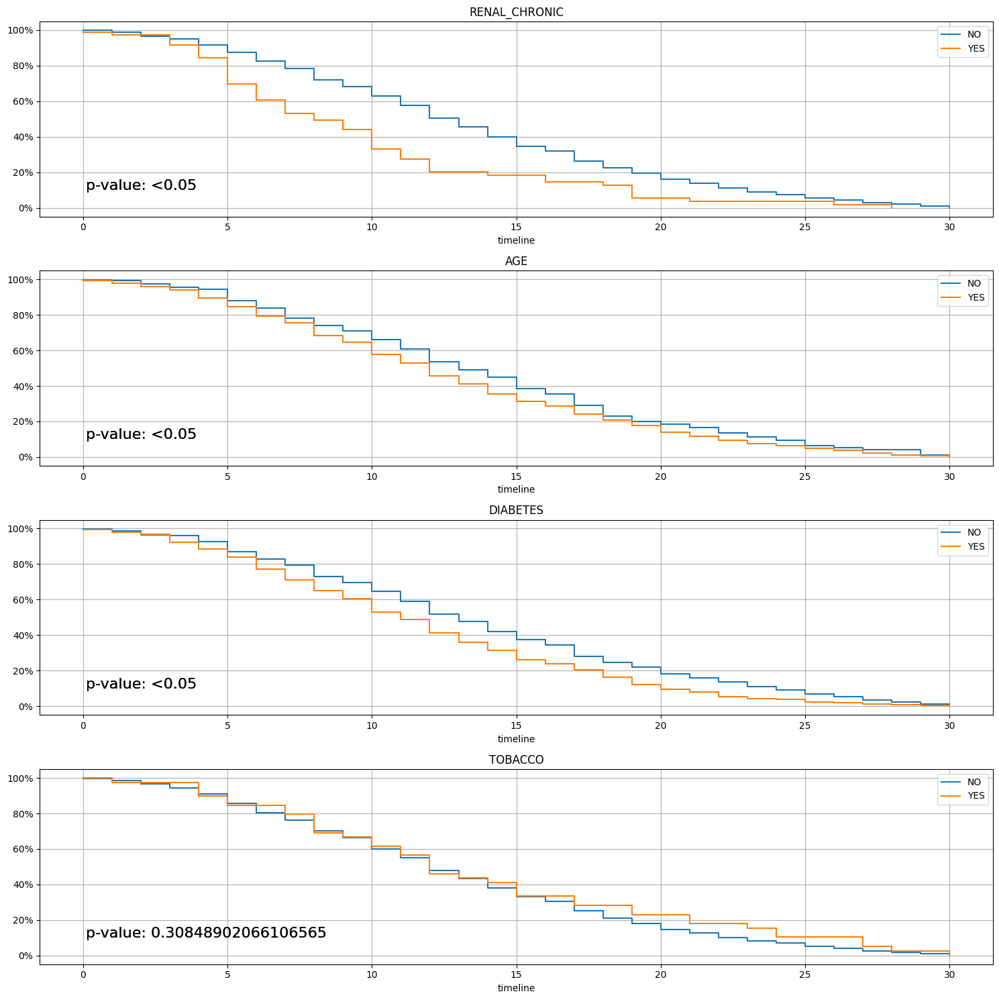
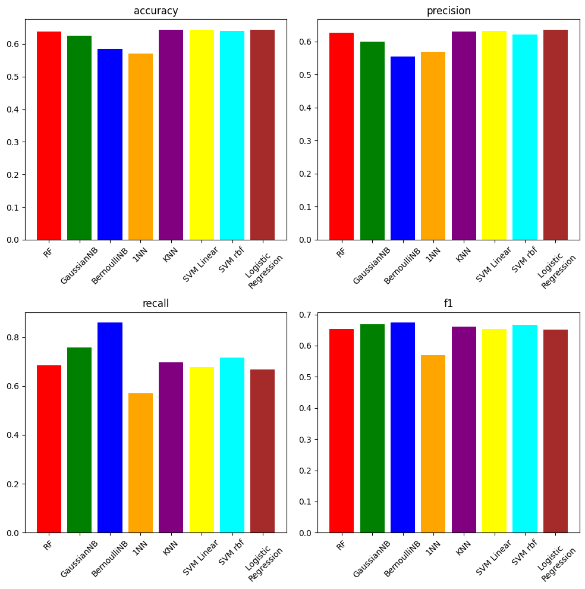

# Covid Risk Prediction

## Introduction

The aim of this project is to implement a binary classifier that, given the current symptoms, state, and medical history of a patient who has contracted Covid-19, is capable of predicting whether the patient is at risk of developing a severe form of the disease or not. Therefore the goal is to find a correlation between the symptoms and the clinical status of the patient to recognize those at risk and provide them with more timely treatment.

Furthermore, a survival model is presented which, given the same informations, is capable of predicting the probability of survival of the patient.

## Screenshots

## License
This project is licensed under the [GNU General Public License v3.0](LICENSE).